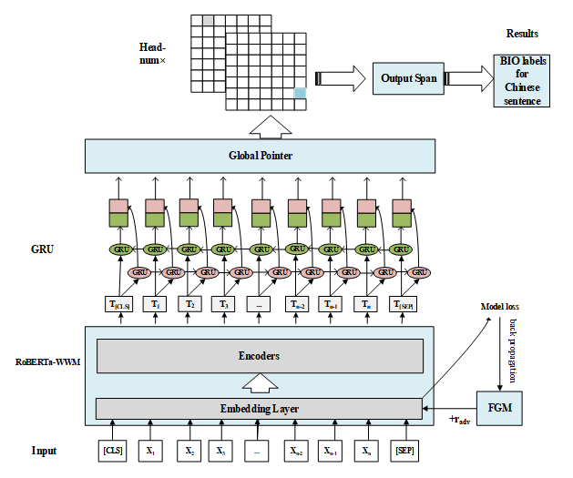
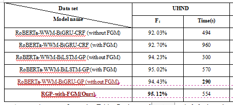

# 文件夹中的数据为中文开源数据合集
# data_out_per_word.txt 为文章根据维族人名特点和数据处理技术得到的维族人名数据集。  

为了研究该模型的抗干扰和边界识别能力，我们构建了一个维吾尔族名称识别数据集UHND。根据维吾尔语名称组成的特点，将姓氏和名字组合起来，生成一个维吾尔语名称。首先，我们建立了一个包含10万个维吾尔族名字的名称数据库。然后，从名称数据库中提取维吾尔语名称数据，随机构造实体文本。最后，我们用80%的概率将汉族名字替换为维吾尔语名字。  
我们构建了21789篇用于维吾尔族名称识别的文本，并选择了其中的5000篇作为测试集。两种名称的比例基本一致，有助于验证RGP-with-FGM模型的有效性。
本文提出一种基于预训练语言模型和全局指针网络的中文命名实体识别模型，并在文中提出的UHND数据集上得到了很好的效果  
模型结构如下：

实验结果如下：  

 
